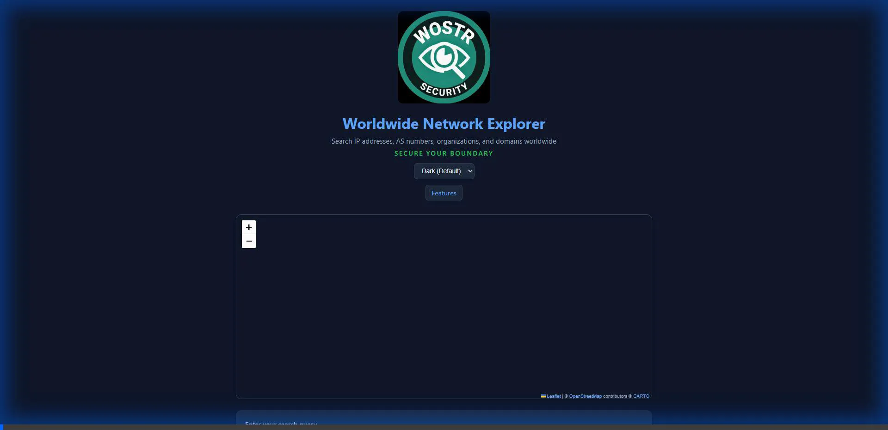

# Worldwide Network Explorer (Terminal)

A high-performance, serverless, Single Page Application (SPA) for exploring worldwide IP network allocations, AS numbers, and organizations.

## 🚀 Live Demo
**[https://avirads.github.io/wostr-terminal/](https://avirads.github.io/wostr-terminal/)**



## ✨ Features
- **Massive Database**: Search over 1.2 million IP-to-ASN records locally in your browser.
- **Natural Language Search**: Queries like "Google in US", "Netflix in JP", or "Hetzner in Germany".
- **Instant Subsequent Loads**: Uses **IndexedDB** to cache the database (28MB) for lightning-fast repeated access.
- **Interactive Map**: Visualize network distributions with a Leaflet-powered world map.
- **Smart CSV Parsing**: Professional engine handles complex organization names with quotes and commas.
- **PWA Ready**: Works offline once the database is cached.
- **Theming**: Supports Dark, Light, Nord, Dracula, GitHub, and Ocean themes.
- **IP Generator**: Click any network range to generate 999 random IPs and download them as a ZIP.

## 💻 Running Locally

### Prerequisites
- A local web server (e.g., Python's `http.server`, `live-server`, or VS Code's Live Server extension).
- No build step is required (Vanilla JS).

### Steps
1. **Clone the repository**:
   ```bash
   git clone https://github.com/avirads/wostr-terminal.git
   cd wostr-terminal
   ```

2. **Start a local web server**:
   Using Python:
   ```bash
   python -m http.server 8000
   ```
   Or using Node.js:
   ```bash
   npx serve .
   ```

3. **Open in Browser**:
   Navigate to `http://localhost:8000` (or the port specified by your server).

### Note on Database
On the first run, the app will:
1. Download `ip-to-asn-20260116.7z` (~7MB).
2. Decompress it using WASM-based `libarchive.js`.
3. Convert the CSV data into an in-memory SQLite database.
4. Cache the resulting database in your browser's IndexedDB.

## 🛠️ Technology Stack
- **Logic**: Vanilla JavaScript (ES6+)
- **Database**: `sql.js` (SQLite WASM)
- **Archive Support**: `libarchive.js` (WASM)
- **UI**: Vanilla CSS (CSS Variables for themes)
- **Map**: Leaflet.js
- **Compression**: JSZip (for IP downloads)

## 📄 License
MIT License. Created by [avirads](https://github.com/avirads).
